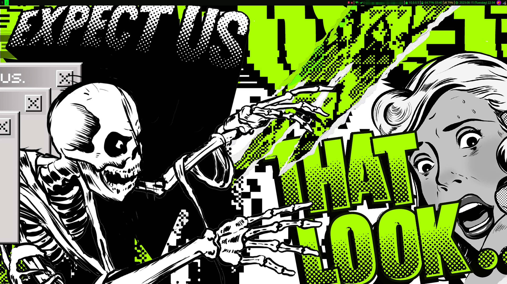
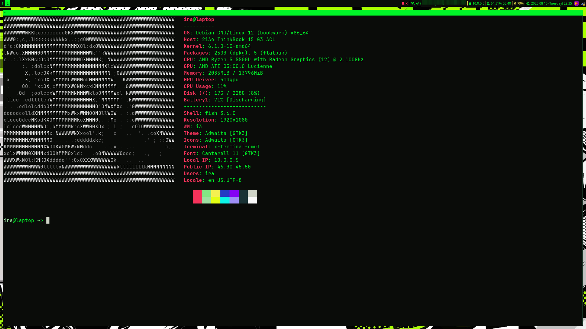
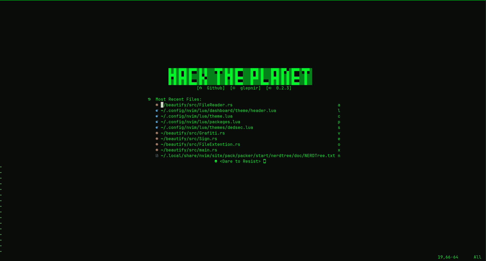
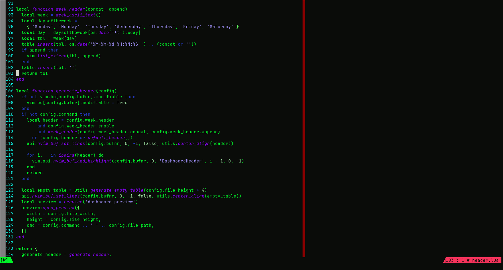
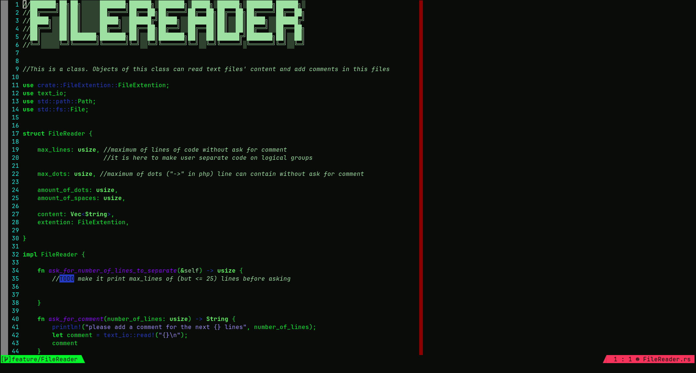

# Configs

This is a repo I use for saving my current config files

## Colorschemes

### Dedsec
The design of the configuration is inspired by watch dogs 2

colors i used:
| hex       | xterm     | color                                                    |
|-----------|-----------|----------------------------------------------------------|
| #0A0C09   | 0         |  |
| #82E684   | 114       |  |
| #9EE0A2   | 151       |  |
| #CFD4C7   | 188       |  |
| #193234   | 22        |  |
| #00F528   | 10        |  |
| #9E8FF6   | 141       |  |
| #8502F4   | 93        |  |
| #243AC3   | 26        |  |
| #0CF5E7   | 50        |  |
| #E3FF14   | 190       |  |
| #F6335B   | 203       |  |
| #F78FB4   | 211       |  |
| #F5CE89   | 222       |  |
| #F4F051   | 227       |  |
| #F9F9F9   | 15        |  |
| #F227F5   | 201       |  |

some screenshots

> color palette was made by https://vk.com/mushroomchips

to get this colorscheme only check the repo: https://github.com/onemorebruh/dedsec

## Obvious information about each component

| name                          | purpouse                                      |
| ----------------------------- | --------------------------------------------- |
| `alacritty`                   | alacritty config file                         |
| `arch_update_playbook.yaml`   | ansible playbook for updating arch systems    |
| `config.fish`                 | file with aliases I use                       |
| `dunst`                       | notification manager config                   |
| `grub_wallpaper.jpg`          | grub wallpaper                                |
| `i3 and i3status`             | dirs with i3 config                           |
| `nvim`                        | my nvim config                                |
| `neofetch`                    | dir with neofetch config and logo             |
| `scripts`                     | dir with bash scripts help me                 |
| `wallpaper.jpg`               | wallpaper                                     |
| `tmux.conf`                   | link to `.tmux/.tmux.conf`                    |
| `tmux.conf.local`             | tmux interface configuration                  |
| `.tmux`                       | default files from oh-my-tmux                 |

## I would like to say about but haven't mention in previous table

`/nvim/colors/dedsec.vim` - colorscheme I made and use. 

`scripts/clear_all_containers.sh` - bash script for destroying all containers and images docker see

`scripts/copy_configs.sh` - bash script for copying actual config to this directory

`scripts/load_configs.sh` - bash script for installing my configs to the system

I have no relation with content of `nvim/lua/dashboard` it was created by another person(sorrily i can't find who did it) and it is here only because dashboard wouldn't work witout it.

## Installation

run `sudo bash ./scripts/load_configs.sh`

## TODO

- [x] add alacritty config
- [ ] add xinitrc
- [x] make and add tmux config
- [ ] update `arch_update_playbook` so it will install all packages I need on all the arch based servers
- [x] add comments to config
- [ ] set close completions without changing by `ESC` in nvim
- [ ] make multicursor mode work in nvim by holding `alt` and clicking
- [x] add installation of modified my nerd-fonts jetbrains mono
- [x] remove configs I don't use anymore
- [x] setup notifications background as black
- [ ] add notifications for such actions as changing volume or brightness
- [ ] make `battery_level_alert.py` start when login
- [x] make neofetch display logo.jpeg/logo.txt by default
- [x] setup custom logo in nvim
- [ ] clean nvim dashboard
- [x] setup nivm bufferlines
- [x] setup nvim galaxyline
- [ ] set keybinding for copying to os' clipboard from nvim's visual mode
